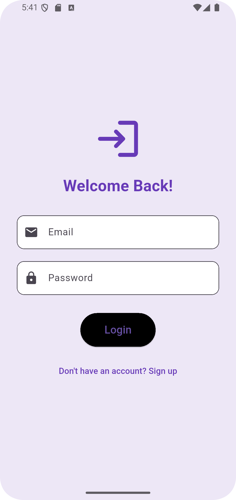
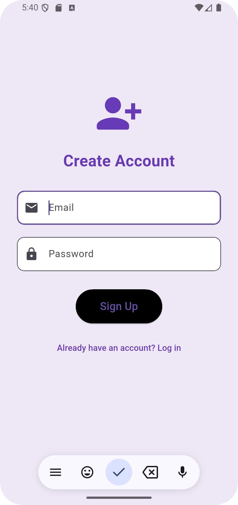

#  Firebase Auth UI App – Flutter 

This Flutter app is a part of my **internship project (Week 5)** where I built a **simple and beautiful Firebase Authentication app** with Email/Password login and signup.

The goal was to build a working **Login/Signup/Profile** flow using Firebase and design a clean user interface with modern UI elements.

---

##  Features

- 🔐 Firebase Email/Password Authentication
- 📥 Signup & Login with form validation
- 👤 Profile page with user info and dummy avatar
- 🚪 Logout functionality
- 🎨 Clean UI using Material Design (Purple Theme)
- 🛡️ Error handling and loading indicators

---

##  Screenshots

| Login Screen | Signup Screen | Profile Screen |
|--------------|---------------|----------------|
|  |  |  |


## ⚙️ Firebase Setup Guide

1. Go to [Firebase Console](https://console.firebase.google.com)
2. Create a new project
3. Add an Android app:
   - Package name: `com.example.user_auth_app`
4. Download `google-services.json` and place it in:
5. In Firebase Console → **Authentication → Sign-in method**, enable **Email/Password**
6. Add these plugins in your `pubspec.yaml`:

```yaml
firebase_core: ^2.31.0
firebase_auth: ^4.17.3
cloud_firestore: ^4.15.3
